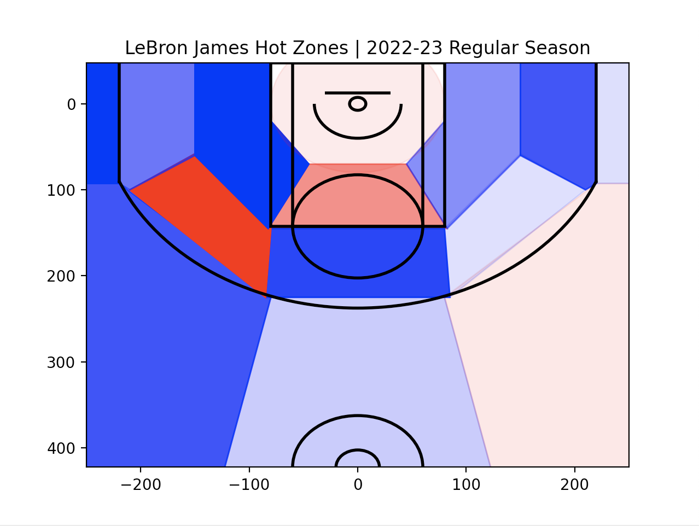

# NBA Player Hot Zones

## Description
This Python program utilizes pandas dataframes and matplotlib graphics to analyze NBA players' shot attempts and compare their shooting statistics with league average stats from various areas of the court. The comparison is done visually, illustrating how well the player is shooting from specific areas of the court. Red areas represent above-average shooting zones (where the player may be 'hot'), whereas blue areas represent below-average zones. The transparency of each section represents how much better or worse the player performs compared to the rest of the NBA.

## How to Run the App
1. Install Python and the required dependencies listed in the `requirements.txt` file by running:
    ```
    pip install -r requirements.txt
    ```
2. Run the Python program by executing:
    ```
    python nba_player_hot_zones.py
    ```
3. Fill in the necessary inputs from the GUI that pops up. Click the Generate button when done to view the player;s shot charts and hot zones.

## Dependencies
- pandas
- matplotlib
- seaborn
- nba_api

## Sample Output


In the sample output above, the shot chart visualizes the shooting performance of LeBron James during the 2022-23 NBA regular season.